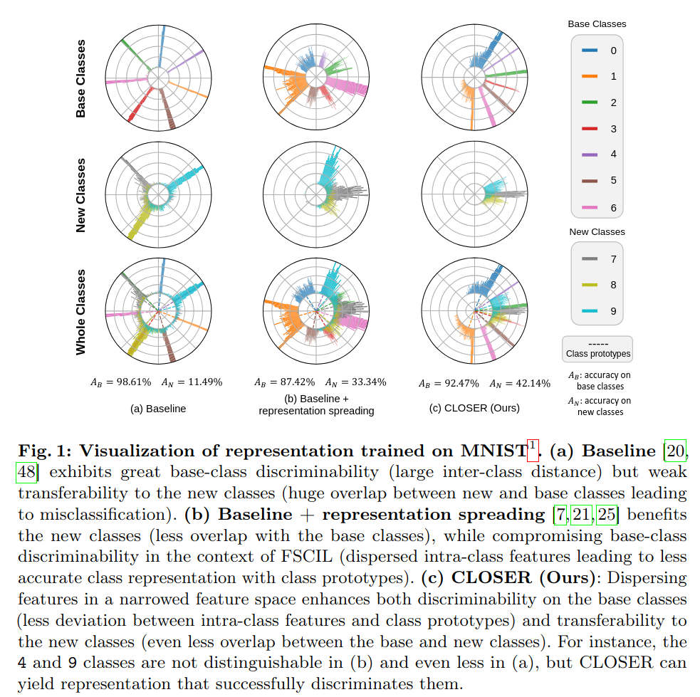

# CLOSER: Towards Better Representation Learning for Few-Shot Class-Incremental Learning
#### Junghun Oh*, Sunyong Baik*, and Kyoung Mu Lee

(!Work in Progress!)

Pytorch implementation of **"CLOSER: Towards Better Representation Learning for Few-Shot Class-Incremental Learning"** accepted in **ECCV2024**.
[Paper]()

If you find this repo useful for your research, please consider citing our paper:
```
@InProceedings{oh2024closer,
  author = {Oh, Junghun and Baik, Sungyong and Lee, Kyoung Mu},
  title = {CLOSER: Towards Better Representation Learning for Few-Shot Class-Incremental Learning},
  booktitle = {IEEE/CVF European conference on computer vision (ECCV)},
  year = {2024}
}
```

## Abstract
Aiming to incrementally learn new classes with only few samples while preserving the knowledge of base (old) classes, few-shot class-incremental learning (FSCIL) faces several challenges, such as overfitting and catastrophic forgetting. Such a challenging problem is often tackled by fixing a feature extractor trained on base classes to reduce the adverse effects of overfitting and forgetting. Under such formulation, our primary focus is representation learning on base classes to tackle the unique challenge of FSCIL: simultaneously achieving the transferability and discriminability of the learned representation. Building upon the recent efforts for enhancing the transferability, such as promoting the spread of features, we find that trying to secure the spread of features within a more confined feature space enables the learned representation to strike a better balance between the transferability and discriminability. Thus, in stark contrast to priory beliefs that the inter-class distance should be maximized, we claim that the CLOSER different classes are, the better for FSCIL. The empirical results and analysis from the perspective of information bottleneck theory justify our simple yet seemingly counter-intuitive representation learning method, raising research questions and suggesting alternative research directions.

## The proposed method



For detailed descriptions on the proposed method and experimental results, please refer to the paper.

## Requirements
- [PyTorch >= version 1.1](https://pytorch.org)
- tqdm
- conda env create -n YourEnv -f dependencies.yaml

## Datasets and pretrained models
We follow [FSCIL](https://github.com/xyutao/fscil) setting to use the same data index_list for training.  
For CIFAR100, the dataset will be download automatically.  
For miniImagenet and CUB200, you can download from [here](https://drive.google.com/drive/folders/11LxZCQj2FRCs0JTsf_dafvTHqFn2yGSN?usp=sharing). Please put the downloaded file under `data/` folder and unzip it:
    
    $ tar -xvf miniimagenet.tar 
    $ tar -xvzf CUB_200_2011.tgz

You can find pretrained models from [here](https://drive.google.com/drive/folders/1ZLQJYJ9IkXcVu7v525oCcJGE-zeJAGF_?usp=sharing). Please download the whole params folder and put under your local CEC project path

## Training & Evaluation - Baseline
cifar100

    $ python train.py -project cec -dataset cifar100 -epochs_base 100 -episode_way 15 -episode_shot 1 -low_way 15 -low_shot 1 -lr_base 0.002 -lrg 0.0002 -step 20 -gamma 0.5 -gpu 0,1,2,3 -model_dir params/cifar100/session0_max_acc7455_cos.pth

mini_imagenet

    $ python train.py -project cec -dataset mini_imagenet -epochs_base 100 -episode_way 15 -episode_shot 1 -low_way 15 -low_shot 1 -lr_base 0.0002 -lrg 0.0002 -step 20 -gamma 0.5 -gpu 0,1,2,3 -model_dir params/miniimagenet/session0_max_acc70367_cos.pth

cub200

    $ python train.py -project cec -dataset cub200 -epochs_base 100 -episode_way 15 -episode_shot 1 -episode_query 10 -low_way 15 -low_shot 1 -lr_base 0.0002 -lrg 0.0002 -step 20 -gamma 0.5 -gpu 0,1,2,3 -model_dir params/cub200/session0_max_acc7552_cos.pth

## Training & Evaluation - CLOSER
cifar100

    $python train.py -project base -dataset cifar100  -base_mode 'ft_cos' -new_mode 'avg_cos' -gamma 0.1 -lr_base 0.1 -lr_new 0.1 -decay 0.0005 -epochs_base 100 -schedule Milestone -milestones 60 70 -gpu 0,1,2,3 -temperature 16
    
mini_imagenet

    $python train.py -project base -dataset mini_imagenet -base_mode 'ft_cos' -new_mode 'avg_cos' -gamma 0.1 -lr_base 0.1 -lr_new 0.1 -decay 0.0005 -epochs_base 100 -schedule Milestone -milestones 40 70 -gpu 0,1,2,3 -temperature 16

cub200
    
    $python train.py -project base -dataset cub200 -base_mode 'ft_cos' -new_mode 'avg_cos' -gamma 0.1 -lr_base 0.1 -lr_new 0.1 -decay 0.0005 -epochs_base 100 -schedule Milestone -milestones 30 40 60 80 -gpu '0,1,2,3' -temperature 16

## Acknowledgment
Our implementation is based on the following repositories:
- [fscil](https://github.com/xyutao/fscil)
- [CEC](https://github.com/icoz69/CEC-CVPR2021)
- [corinfomax-ssl](https://github.com/serdarozsoy/corinfomax-ssl)
- [SupContrast](https://github.com/HobbitLong/SupContrast)

